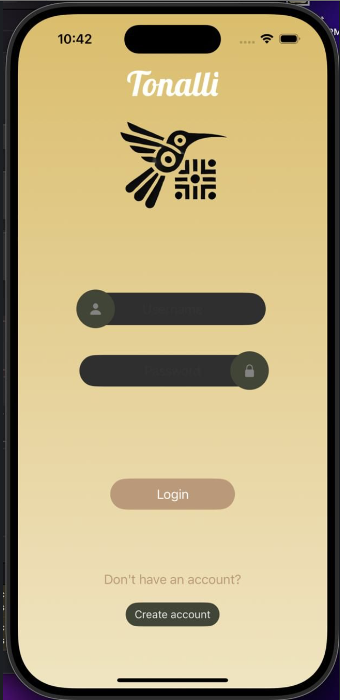

# Tonallli

## Overview:
Tonalli is an iOS app created during HackMTY 2024 that enables real-time text and voice translations between tourists and indigenous language speakers, promoting cultural understanding and language preservation.

## Purpose:
Tonalli bridges communication gaps, fostering meaningful connections and preserving endangered languages through accurate, real-time translations.

## Key Features:
 * Real-Time Translation: Converts speech and text instantly between tourists and indigenous language speakers.
 * Voice & Text Support: Users can speak or type messages for immediate, accurate translations.
 * Cultural Context Awareness: Delivers translations that preserve the meaning and nuance of indigenous languages.
 * Offline Access: Stores frequently used translations for quick retrieval without internet access.
 * User-Friendly Experience: Intuitive UI designed for accessibility and ease of use.

## Technology Stack
### Mobile Development:
* Swift: Built the iOS app with a seamless and intuitive user interface.
  
### Machine Learning:
* TensorFlow: Developed and trained translation models to enhance accuracy and cultural relevance.

### Cloud Services:
* Google Cloud APIs: Integrated Speech-to-Text and Text-to-Speech for real-time voice translations.

### Database:
* PostgreSQL: Managed storage and retrieval of saved translations for offline and historical access.

### Backend:
* Flask: Handled user requests, data flow, and translation processing.

### Data Processing:
* ETL Workflows: Collected, cleaned, and structured 15,000+ linguistic records via web scraping and APIs to ensure high-quality and reliable translations.

## Contribution:

### To Cultural Preservation:
Tonalli fosters cultural understanding by making indigenous languages accessible to a wider audience, promoting meaningful interactions and preserving endangered languages.

### To Tourists & Indigenous Communities:
The app enables real-time communication, empowering cultural exchange between tourists and indigenous speakers. With machine learning and an intuitive interface, Tonalli redefines language translation.

## Tonalli Demo

### Home

 
  

